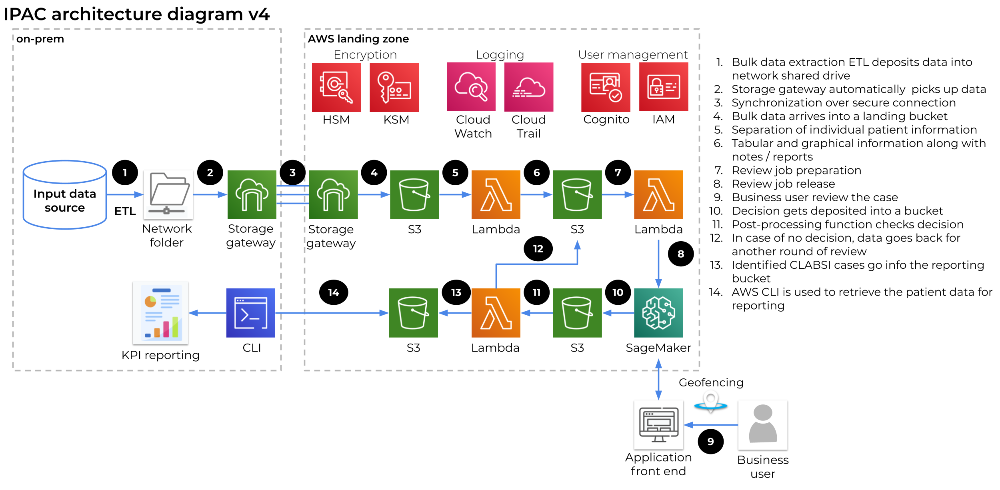

Deploying this Quick Start for a new virtual private cloud (VPC) with
*default parameters* builds the following _{partner-product-name}_ environment in the
AWS Cloud.

// Replace this example diagram with your own. Send us your source PowerPoint file. Be sure to follow our guidelines here : http://(we should include these points on our contributors giude)

Figure 1: Quick Start architecture for _{PHC_IPAC_CLABSI}_ on AWS

As shown in Figure 1, the Quick Start sets up the following:

* Bulk data extraction ETL deposits data into network shared drive. 
* Storage gateway automatically picks up data. 
* Synchronization over secure connection. 
* Bulk data arrives into a landing bucket. 
* Separation of individual patient information. 
* Labeling Jobs are created usign SageMaker GroundTruth
* Review job preparation 
* Review job release 
* Business user review the case 
* Decision gets deposited into a bucket 
* Post-processing function checks decision 
* In case of no decision, data goes back for another round of review 
* Identified CLABSI cases go in to the reporting bucket 
* AWS CLI is used to retrieve the patient data for reporting 
