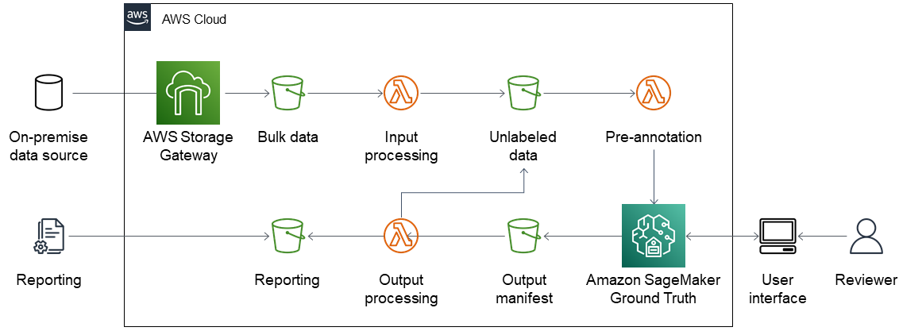

Deploying this Quick Start builds the following {partner-product-short-name} environment in the AWS Cloud.

:xrefstyle: short
[#architecture1]
.Quick Start architecture for {partner-product-name} on AWS

As shown in <<architecture1>>, the Quick Start sets up the following:

* Amazon Storage Gateway to retrieve bulk patient data from an on-premises source and deposit it into an Amazon Simple Storage Service (Amazon S3) bucket.
* Amazon S3 buckets to store bulk data, partitioned data, output data from Amazon SageMaker Ground Truth, and indentified infection cases for reporting. 
* Three AWS Lambda functions 
** A function to retrieve and partition bulk data into individual review cases and save them to an S3 bucket.
** A function to process the input manifest for Amazon SageMaker GroundTruth. It retrieves data from the partitioned data S3 bucket and transforms it into the JavaScript Object Notation (JSON) format required by Ground Truth.
** A function to retrieve and process Ground Truth output data. It sends cases with no decision to the partitioned data and initiates another review job in Ground Truth. It deposits cases labeled as confirmed infections to a reporting S3 bucket.
* Amazon SageMaker Ground Truth to provide the user interface.
* AWS Key Management Service (AWS KMS) to encrypt data (not shown).
* Amazon Cognito to provide authentication, authorization, and user management for the Ground Truth user interface (not shown).
* AWS Identity and Access Management (IAM) to enforce the principle of least privilege on each processing component (not shown).
* Amazon CloudWatch Logs to monitor Storage Gateway for errors (not shown).
