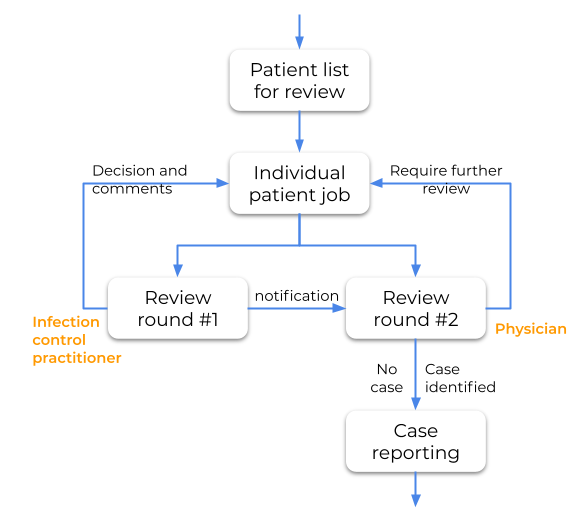

// Replace the content in <>
// Briefly describe the software. Use consistent and clear branding. 
// Include the benefits of using the software on AWS, and provide details on usage scenarios.

<Describe how the software works on AWS.>

== *Background*
A central line-associated bloodstream infection (CLABSI) is a serious infection that occurs when germs enter the bloodstream through a catheter (tube) that healthcare providers often place in a large vein in the neck, chest, or groin to give medication or fluids or to collect blood for medical tests.

Because CLABSI can be prevented through proper insertion techniques and management of the central line, surveillance systems are crucial in any inpatient location where denominator data can be collected, which can include
critical/intensive care units (ICU), specialty care areas (SCA), neonatal units including neonatal intensive care units (NICUs), step down units, wards, and long term care units.

Monitoring CLABSI levels and identifying individual cases, associated nursing units and outbreaks are mandatory, but also important to reduce harm and to improve the quality of patient safety. Our tool provides an interface to help the process.

## *Software*

Our application provides an interface for Infection Control Practitioners (ICPs), Physicians and Epidemiologists to review potential CLABSI cases and classify the information. It is a requirement that each patient undergoes at least two round of reviews, one from ICPs and one from the Physician group.

### Components

#### Input information
Bulk patient information is required on potential CLABSI cases for a reporting period. A filter for patient who underwent *central line insertion* and developed a *blood stream infection* is usually necessary to reduce the number of patient record that needs review.

The application requires Excel file as an input with two sheets. +
1) 1st sheet: Patient information. Each record corresponds to a positive blood collection event. +
2) 2nd sheet: Body temperature information. Depending on the pathogen, blood stream infections often associated with fever. Each record of this sheet represents a time point when temperature reading was done. +

#### Pipeline
The application consists of multiple processing AWS lambda functions that process the input information and prepare the data for the manual review process, as well as post review processing steps. All data in between processing steps are stored as S3 objects. +

.IPAC-CLABSI architecture diagram
image::./IPAC_architecture_diagram_v4.png[]

#### User interface
The application utilizes AWS SageMaker Ground Truth as a user interface. A single Ground Truth labeling / reviewing job provides all information about a patient disregard of having one or multiple CLABSI events. The decision is done on the patient level.

#### Result
The application accumulates all decision information from the reviewer team and genarates and aggregated data file. This file contains all input data with the decision made during the review process along with additional information like reasons of the decision, type and subtype classifications.

### Decision process
.IPAC-CLABSI case review process

